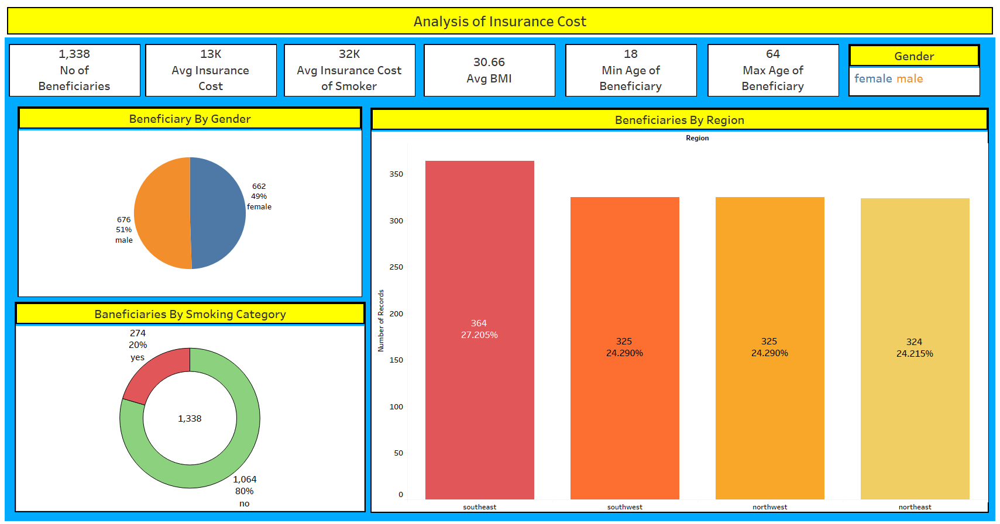
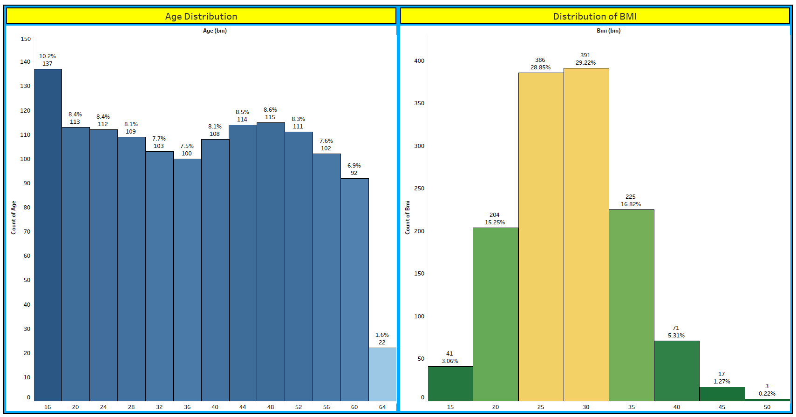
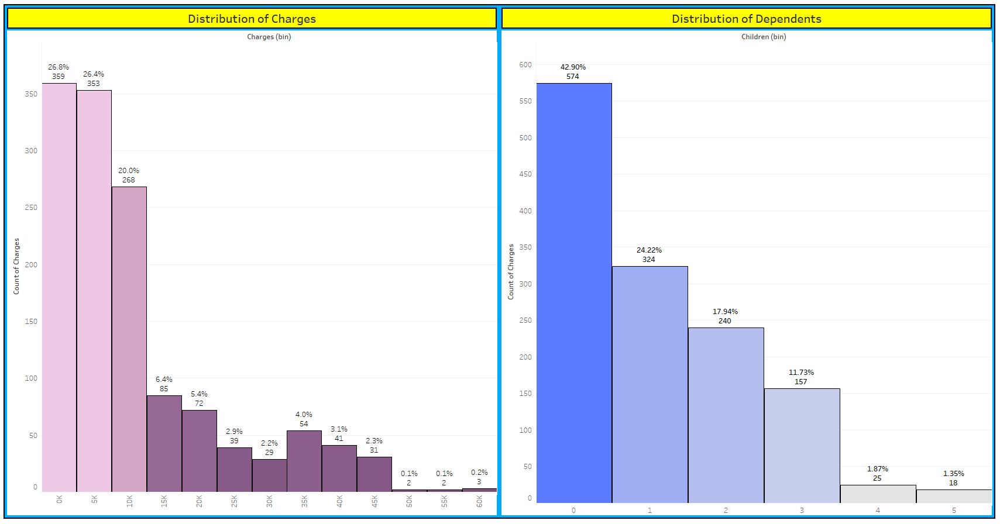
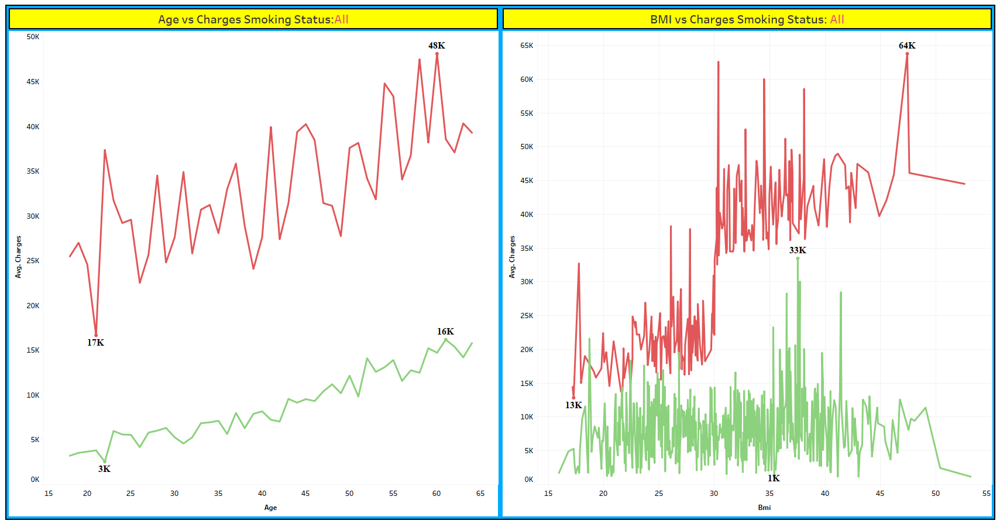

# Insurance Premium Prediction

This project revolves around solving a Machine Learning Regression Problem to accurately predict insurance charges. The primary objectives of this project are as follows:

- To predict insurance charges with high accuracy, facilitating efficient cost analysis for the company.
- To minimize the time and operational expenses required for analyzing customer information and determining charges.
- To automate the process, creating a hassle-free experience for customers.
- You can visit the site for making predictions [here]().

## Methods Used:

- Data Visualization
- Data Preprocessing
- Tabluea DashBoard
- Machine Learning
- Predictive Modeling

## Technologies Utilized:

- Python
- Pandas
- Numpy
- Jupyter-notebook
- Scikit-learn
- XGBoost
- CatBoost
- HTML
- CSS
- Flask

## Project Description:

This project addresses the challenge of predicting insurance charges by utilizing machine learning regression techniques. The primary aim is to accurately estimate charges for the company's customers. By achieving high accuracy in predictions, the project reduces both cost and time spent by the company in this process. Additionally, the automation of this process allows customers to quickly and easily access information regarding their charges with minimal input required.

- The dataset employed in this project is obtained from Kaggle, which can be accessed [here](https://www.kaggle.com/datasets/mirichoi0218/insurance).
- It consists of the following variables:
  - Age: Age of the primary beneficiary.
  - Gender: Gender of the insurance contractor (male or female).
  - BMI: Body Mass Index of the beneficiary (ideal range is between 18.5 to 29.5).
  - Children/Dependents: Number of dependents or children covered by the insurance.
  - Smoker: Indicates whether the beneficiary is a smoker or not.
  - Region: The beneficiary's residential area in the US (northeast, southeast, southwest, northwest).
  - Charges: Individual medical costs billed by health insurance.

## Notebook and Tableau visualization.

- **Insights and visualization [here](https://github.com/rushin236/insurance-premium-prediction/blob/main/notebooks/Insurance_Cost_Prediction_EDA.ipynb)**.
- **Tableau Dashboard file [here](https://github.com/rushin236/insurance-premium-prediction/blob/main/tableau/Insurance%20Cost%20Prediction.twb)**.

## Tableau DashBoard

## Thanks you for visiting!

## Contact

- GitHub: [rushin236](https://github.com/rushin236?tab=repositories).
- Email: rushikeshshindesandesh@gmail.com
- LinkedIn: [rushikeshshinde](https://www.linkedin.com/in/rushikeshshinde987/).
